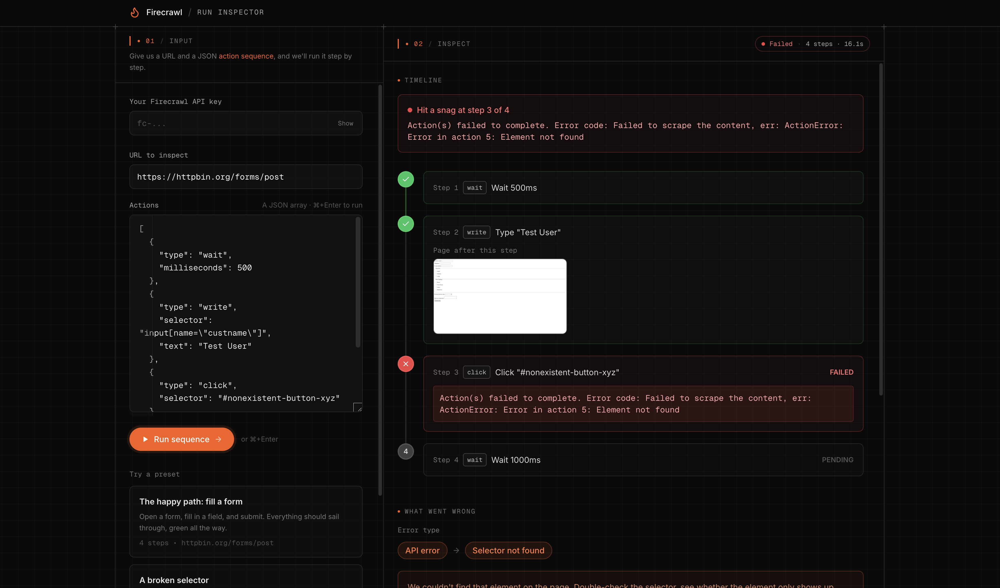

<div align="center">

# 🔥 Firecrawl Run Inspector

### See exactly what happened inside every Firecrawl Scrape run.

A step-by-step timeline with screenshots, timing, and plain-English failure attribution so when a multi-step scrape breaks, you know which step, why and what the page looked like at that moment.

[](https://www.firecrawl.dev)
[](https://nuxt.com)
[](https://vuejs.org)
[](#license)



</div>

---

## Why?

Production scraping workflows are opaque. When a 14-step action sequence fails, you get a single
`SCRAPE_FAILED` and no context. Which step broke? Was it a bad selector, or did the page change?
What did the page even look like when it gave up?

Run Inspector is the observability layer for [Firecrawl](https://www.firecrawl.dev) Actions.
Paste a URL and an actions array, hit run, and it instruments the execution with per-step
screenshots and timing — then hands back a timeline with failure attribution and a clear
explanation of what went wrong.

It's open source so you can run it locally, drop it into your own internal tools or use it as a
reference for building on the Firecrawl SDK.

## Features

- **Failure attribution** — "Hit a snag at step 3 of 4," not a generic error. Every step is
  mapped back to *your* original action, never the instrumented one.
- **Per-step screenshots** — see the page state before and after each action, with a click-to-zoom
  lightbox. Captured from a single browser session.
- **Error classification** — selector-not-found, wait/navigation/API timeouts, rate limits,
  CAPTCHA/blocks, empty results — each with tailored, human advice on how to fix it.
- **Last-good screenshot** — on failure, the page is replayed up to (but not including) the
  failing step so you can see exactly what it looked like before things broke.
- **Rate-limit aware** — automatic exponential backoff on 429s, with the retry timeline surfaced
  in the UI.
- **Honest warnings** — screenshot-count mismatches, empty sequences, and degraded (network-drop)
  results are flagged instead of silently swallowed.
- **Bring your own key** — paste a Firecrawl API key (kept in your browser's local storage, sent
  per-request) or configure one server-side. The key never gets baked into the client bundle.
- **Built for speed** — JSON editor with `⌘/Ctrl + Enter` to run, inline validation, three ready
  presets, and cancelable runs.

## Quick start

**Prerequisites:** Node.js 20+ and a Firecrawl API key ([grab one free](https://www.firecrawl.dev/app/api-keys)).

```bash
# 1. Install dependencies
npm install

# 2. (Optional) configure a server-side API key
echo "FIRECRAWL_API_KEY=fc-your-key-here" > .env

# 3. Start the dev server
npm run dev
```

Open **http://localhost:3000**, paste your key (or rely on the `.env` one), pick a preset, and hit
**Run sequence**.

> **No `.env`? No problem.** You can paste your API key directly in the UI — it's stored locally in
> your browser and sent with each request, never persisted server-side.

## Configuration

| Variable | Required | Description |
| --- | --- | --- |
| `FIRECRAWL_API_KEY` | Optional | Server-side fallback key. A key entered in the UI (sent via the `x-firecrawl-api-key` header) always takes precedence. |
| `FIRECRAWL_API_URL` | Optional | Firecrawl API base URL. Defaults to `https://api.firecrawl.dev`. |

## How it works

Firecrawl runs an entire actions array in one call and, on a mid-sequence failure, throws for the
*whole* request. Run Inspector turns that into a per-step story with two small tricks:

**1. Single-call instrumentation.** Before sending, it weaves a `screenshot` action between each of
your steps:

```
[ ss₀, action₀, ss₁, action₁, ss₂, …, actionₙ₋₁, ssₙ ]
```

One scrape call, one browser session, one bill — and the ordered `screenshots[]` map cleanly back to
each of your steps.

**2. Failure attribution + last-good replay.** The catch: those step screenshots only come back when
the run *succeeds*. A mid-sequence failure throws for the **whole** call and returns nothing — no
partial results — so the one moment you most want to see is the one Firecrawl won't give you. So when
it reports `Error in action N`, we map `N` back to your original step, classify the error, then re-run
just the *prefix* (`actions[0…N-1]`) in the **same browser profile** to recover a screenshot of the
page right before it broke. Replaying in the same profile preserves the cookies, login, and
navigation state the failing step actually saw — a fresh session could land on a different page and
show you a misleading screenshot.

### Supported actions

`wait` · `click` · `write` · `press` · `scroll` · `screenshot` · `scrape` · `executeJavascript`

## Project structure

```
app/
├── app/                       # Nuxt app source (srcDir)
│   ├── components/            # ActionEditor, ActionTimeline, FailureDetail, StepCard, …
│   ├── composables/           # useRunInspector, useActionForm, useApiKey, usePresets
│   ├── pages/index.vue        # the single-page workbench
│   ├── types/                 # shared TypeScript contract (single source of truth)
│   └── utils/                 # $t/$tm helpers, formatting, action labels
├── server/
│   ├── api/run.post.ts        # validate → instrument → scrape → build timeline
│   ├── api/verify.get.ts      # error-format self-check status
│   └── utils/                 # apiKey, errors, instrument, retry, verification
├── shared/utils/i18n.ts       # framework-agnostic translator (used by app + server)
├── locales/en.json            # all user-facing copy lives here
└── tests/ui.spec.ts           # Playwright end-to-end suite
```

## Tech stack

[Nuxt 4](https://nuxt.com) · [Vue 3](https://vuejs.org) · [Nitro](https://nitro.build) ·
[Tailwind CSS](https://tailwindcss.com) · [Zod](https://zod.dev) ·
Firecrawl HTTP API ·
[Playwright](https://playwright.dev) · TypeScript

Firecrawl calls run **server-side only**, so your API key never reaches the browser bundle. All
copy is centralized in `locales/en.json` and resolved through a tiny shared `$t()` helper.

## Testing

The UI is covered by a Playwright end-to-end suite (page structure, presets, validation, success /
failure / empty / timeout / rate-limited runs, warnings, the screenshot lightbox, and API-key
handling).

```bash
npx playwright install   # first run only — fetches the browser
npx playwright test
```

## Production

```bash
npm run build     # build for production
npm run preview   # preview the production build locally
```

Run Inspector is a standard Nuxt app and deploys anywhere Nitro runs — Vercel, Netlify, Cloudflare,
a Node server, or a container. See the [Nuxt deployment docs](https://nuxt.com/docs/getting-started/deployment).

## Contributing

Issues and PRs are welcome. This repo is also meant to be read — clone it, poke around
`server/api/run.post.ts`, and use it as a starting point for your own Firecrawl tooling.

## License

Released under the **MIT License** — use it, fork it, ship it.

---

<div align="center">

<sub>Run Inspector is a community/demo utility for working with Firecrawl Actions.</sub>

</div>
